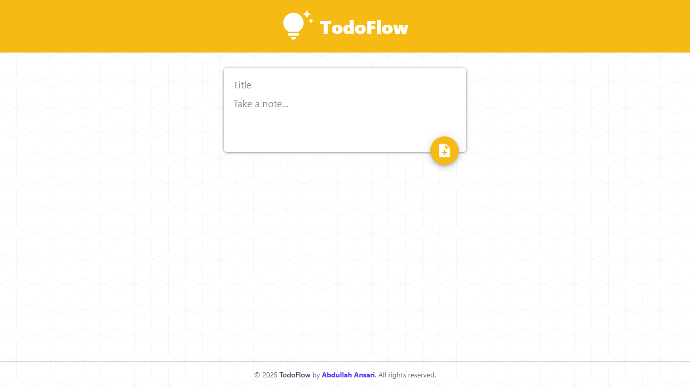
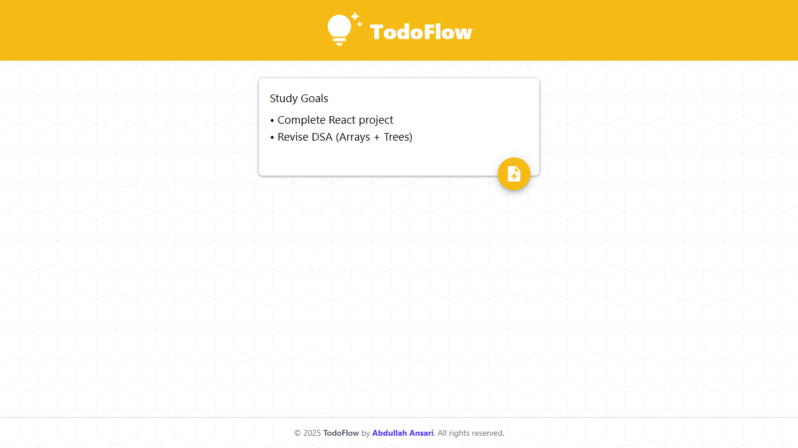
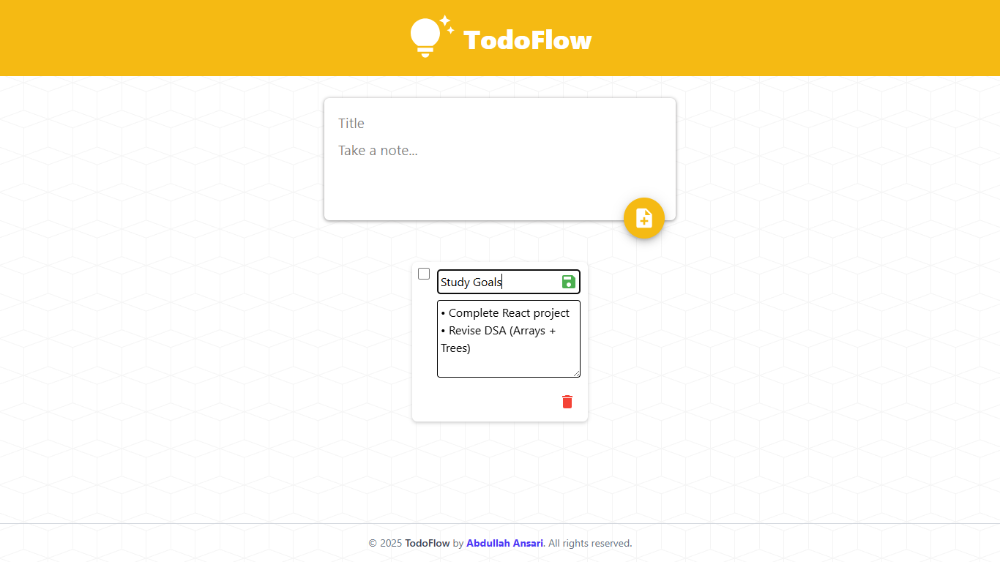
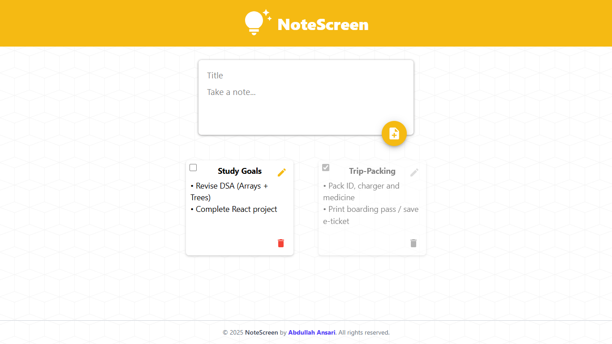
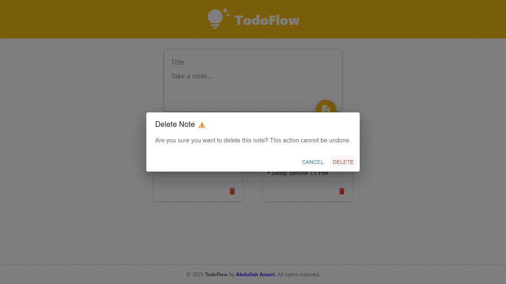

# ✏️ noteScreen

A minimal and responsive **React-based Todo app** to organize your daily tasks. Built with clean UI, real-time editing, and persistent browser storage.

---

## 🚀 Features

- 📝 **Add** multiple todos with title & content
- ✅ **Mark** todos as completed via checkbox
- 🛠️ **Edit** tasks in-place
- 🗑️ **Delete** tasks with confirmation modal
- 💾 **Auto-saves todos locally** (via browser's localStorage)

---

## 🖼️ Screenshots

### 🔍 Preview

> _Overview of the noteScreen UI_

### ➕ Add Task

> _Adding a new todo with title & description_

### 🛠️ Edit Task

> _Editing an existing task inline_

### ✅ Mark Complete

> _Marking a todo as completed (checkbox disables editing)_

### 🗑️ Delete Task

> _Delete confirmation modal before removing a task_

---

## 🛠️ Tech Stack

| Technology                                                                                                           | Description                                            |
| -------------------------------------------------------------------------------------------------------------------- | ------------------------------------------------------ |
|                     | Frontend UI framework                                  |
|      | Core scripting language                                |
|  | Utility-first CSS styling                              |
|                   | Icons & modal components                               |
| 🗂️ **Browser Storage**                                                                                               | Uses `localStorage` to persist todos without a backend |

---
